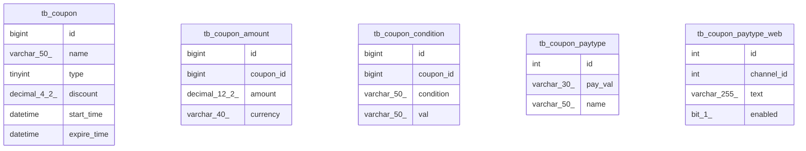

# Category-Based ERD Demo

## Before: Single Monolithic ERD (766 tables)

```
❌ Problem: Overwhelming and unreadable
- All 766 tables in one diagram
- Exceeds Lark's 100K character limit
- Can't see relationships clearly
- Poor onboarding experience
```

## After: Category-Based ERDs (130 categories)

```
✅ Solution: Split by domain

wallet/ (170 tables)
├── tb_wallet_account
├── tb_wallet_transaction
├── tb_wallet_balance
└── ... 167 more

user/ (81 tables)
├── tb_user_profile
├── tb_user_auth
├── tb_user_settings
└── ... 78 more

card/ (70 tables)
├── tb_card_account
├── tb_card_apply_channel
├── tb_card_transaction
└── ... 67 more

... 127 more categories
```

## Command Output

```bash
$ lore generate-erd --output-dir ./erd_output

✓ Generated 130 category ERDs in ./erd_output/

Categories:
  - wallet          (170 tables) → erd_wallet.mmd
  - user            ( 81 tables) → erd_user.mmd
  - card            ( 70 tables) → erd_card.mmd
  - sales           ( 21 tables) → erd_sales.mmd
  - cpa             ( 19 tables) → erd_cpa.mmd
  - commission      ( 18 tables) → erd_commission.mmd
  - legacy          ( 18 tables) → erd_legacy.mmd
  - mt4             ( 15 tables) → erd_mt4.mmd
  - payment         ( 15 tables) → erd_payment.mmd
  - pt              ( 15 tables) → erd_pt.mmd
  - salary          ( 15 tables) → erd_salary.mmd
  - account         ( 11 tables) → erd_account.mmd
  - data            ( 13 tables) → erd_data.mmd
  - sys             ( 13 tables) → erd_sys.mmd
  - ib              (  9 tables) → erd_ib.mmd
  - bybit           (  8 tables) → erd_bybit.mmd
  - config          (  8 tables) → erd_config.mmd
  - dap             (  8 tables) → erd_dap.mmd
  - mt5             (  8 tables) → erd_mt5.mmd
  ... and 111 more categories

To view ERDs, upload .mmd files to https://mermaid.live or use a Mermaid viewer.
```

## Overview Diagram

```bash
$ lore generate-erd --output-dir ./erd_output --overview

✓ Generated category overview: ./erd_output/erd_overview.mmd
```

Shows high-level category relationships:
- `wallet_domain` (170 tables: tb_wallet_account, tb_wallet_transaction, ...)
- `user_domain` (81 tables: tb_user_profile, tb_user_auth, ...)
- `card_domain` (70 tables: tb_card_account, tb_card_apply, ...)
- Cross-category references visualized

## Sample Category: Coupon (5 tables)



## Benefits

### 1. Focused Documentation
Each team sees only their domain:
- Wallet team: `erd_wallet.mmd`
- User management: `erd_user.mmd`
- Card services: `erd_card.mmd`

### 2. Onboarding
New developers can:
1. Check the overview to understand system structure
2. Drill into their category's ERD
3. See cross-category dependencies via comments

### 3. Impact Analysis
When modifying `tb_wallet_account`:
1. Open `erd_wallet.mmd` to see related wallet tables
2. Check overview for categories that reference wallet
3. Review those category ERDs for cross-references

### 4. Version Control
- Small, focused files (vs. one huge ERD)
- Easy to see what changed in diffs
- Can review category-by-category

### 5. Automated Documentation
```bash
# In CI/CD pipeline
lore init --db $DATABASE_URL
lore generate-erd --output-dir docs/erd
git add docs/erd/
git commit -m "docs: update schema ERDs"
```
